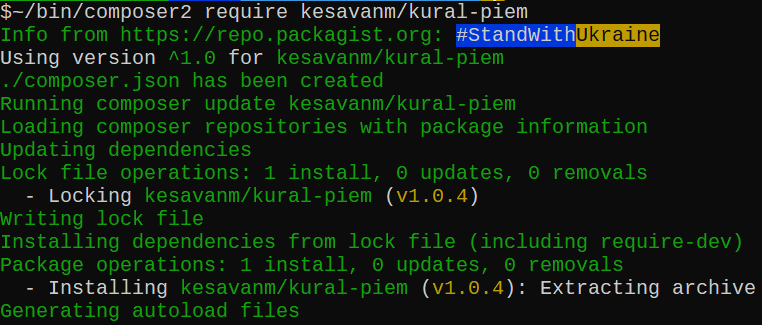
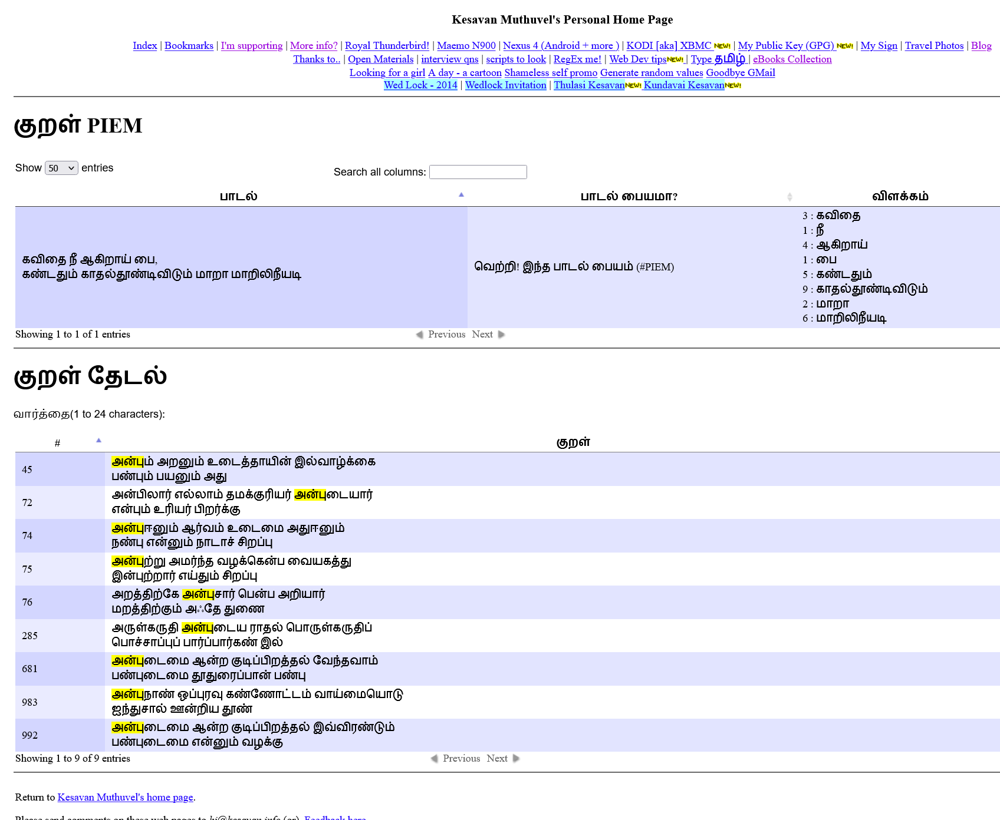

###  π'em -  PIEM ( PI + POEM)

Trying to find a PIEM in தமிழ் திருக்குறள்.


#### Installation

 - Can be used as standalone script
 - As a dependency using `composer` (tested using v2)
   - Execute `composer require kesavanm/kural-piem`
     (OR)
   -  Alternatively you can create a `composer.json` with the following  

        ```bash
        $bat composer.json
        ────┬──────────────────────────────────────────
            │ File: composer.json
        ────┼──────────────────────────────────────────
        1   │ {
        2   │     "require": {
        3   │         "kesavanm/kural-piem": "^1.0"
        4   │     }
        5   │ }
        ────┴──────────────────────────────────────────
        ```
        and later execute `composer update` to install

    

#### Outcome

- Live result: Sample usage of [Kural page from `https://kesavan.info`](https://kesavan.info/kural) Source avail [here](https://github.com/kesavanm/kesavan.info/).
 

 - Standalone execution may similar to:
    ```shell
    $php sample-kural.php
    வெற்றி! இந்த பாடல் பையம் (#PIEM) :
    உள்ளீடு: ==========>கவிதை நீ ஆகிறாய் பை, கண்டதும் காதல்தூண்டிவிடும் மாறா மாறிலிநீயடி<==========
    Array
    (
        [0] => 3 : கவிதை
        [1] => 1 : நீ
        [2] => 4 : ஆகிறாய்
        [3] => 1 : பை
        [4] => 5 : கண்டதும்
        [5] => 9 : காதல்தூண்டிவிடும்
        [6] => 2 : மாறா
        [7] => 6 : மாறிலிநீயடி
    )
    ```
#### Editor source view (Initial version)
