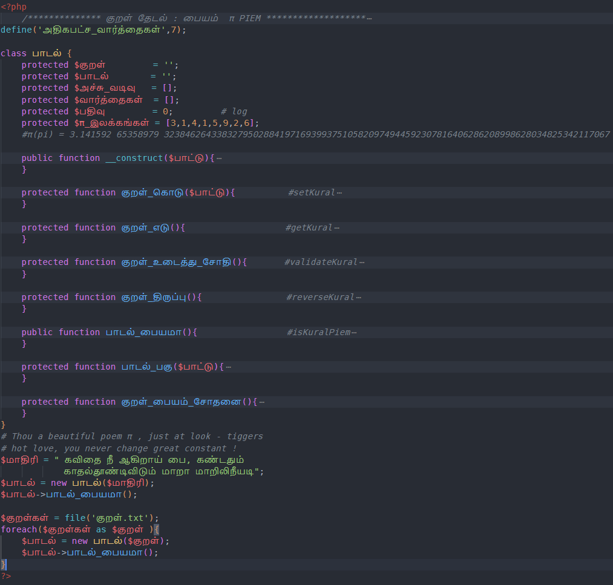

###  π'em -  PIEM ( PI + POEM)

Trying to find a PIEM in தமிழ் திருக்குறள்.

Outcome may look like:
```shell
$php kural.php
வெற்றி! இந்த பாடல் பையம் (#PIEM) :
உள்ளீடு: ==========>கவிதை நீ ஆகிறாய் பை, கண்டதும் காதல்தூண்டிவிடும் மாறா மாறிலிநீயடி<==========
Array
(
    [0] => 3 : கவிதை
    [1] => 1 : நீ
    [2] => 4 : ஆகிறாய்
    [3] => 1 : பை
    [4] => 5 : கண்டதும்
    [5] => 9 : காதல்தூண்டிவிடும்
    [6] => 2 : மாறா
    [7] => 6 : மாறிலிநீயடி
)
```

